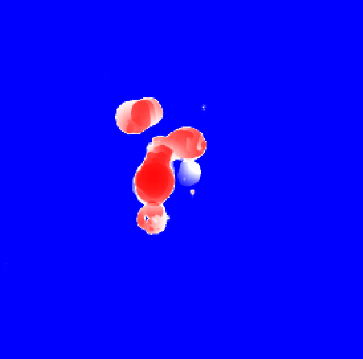
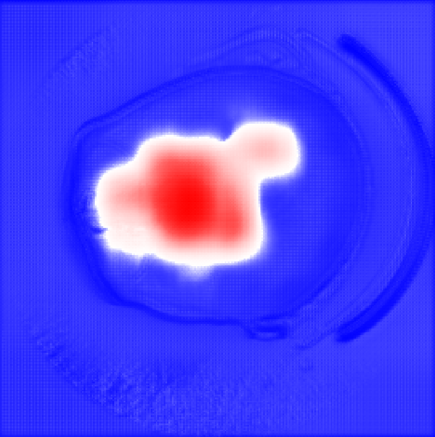

# v0.0.6 Release Notes

## Highlights
- Changed the input for the model from a a big voxel int 64x64x64 patches. 
- Created a function that generates patches from the train dataset. 
- Changed the label from hard label to soft labels (3D Gaussian heatmap around the aneurysm center).
- Changed the loss function to accept soft labels and try to remove false positives.
- Added new metrics: 
    - Peak localization error (distance between predicted heatmap peak and target peak)
    - Core dice (overlap of binaired target and prediction >= 0.5)
    - Sensitivity (fraction of aneurysms positive flagged correctly (TP/TP+FN))
    - ppv (among predicted positives, fraction that is correct (TP/TP+FP))
    - npv (among predicted negatives, fraction that is correct (TN/TN+FN))
    - Mean/ max prob (avg and max sigmoid over label == 0)
- Added an optimized attention block on the U-net architecture.

## Motivation
- Training on full volumes is memory intensive and slow. Patches allow for faster training and more variety in the input data. 

-  By training with a sliding window, it might take a long time to train the model, and there might be patches with zero values, so we created our own function to generate useful patches. For inference we use a patch size of 64 with a stride of 24, and an average input of 256×256×256. With a sliding window, we would have ((256−64)/24)^3 = 512 patches per patient for training, but we choose only 6 meaningful ones. Thus, from a possible training dataset of 512×1041 = 532,992 patches, we end up with 8,899 patches. With our base model, it takes 10 minutes per epoch with our current strategy, but if it were to take each patch, it would've taken 10 hours per epoch. 

- After we ran some experiments, we realised that using hard labels (a sphere full of 1s for the aneurysm) makes the model to not focus on background information. Using soft labels (Gaussian 3D heatmap) we observed the model now understands some marginins within the voxel. Below there are 2 probability masks given for the same patient with an aneurysm. 

|  |  |
|---|---|
| **Hard labels**: tends to ignore background context and produces coarse/vague boundaries.  | **Soft labels**: helping the model learn margins and some nearby vessel structure, get more informative predictions. |

- By changing the target with a soft label, we need to change the loss function as well. We went through many iteration untill we get to the final result, so let's get it step by step: 
    - First, we change the base DCE loss with DML2 (DiceSemimetricLoss). We used this paper: [Dice Semimetric Losses: Optimizing the Dice Score with Soft Labels](https://arxiv.org/html/2303.16296v4#bib.bib15) as guidance.

        The old dice loss: $\text{Dice}= 1 - \frac{2\text{IoU}^c}{1+\text{IoU}^c}= 1 - \frac{2|v^c|}{|x^c|+|y^c|}$    
        The new dice loss: $ \overline{\Delta}_{\text{DML2}} = 1 - \frac{2* \langle x, y\rangle}{2* \langle x, y\rangle+\|x-y\|_1}$
        $, \|x-y\|_1$ represents the symmetric difference and $\langle x, y\rangle$ the intersection.

    - We ran the model but realised that it has a lot of noise for non-aneurysm patches, so we propose a Negative loss that for each negative patch, it will penalize the model if it has high probability, the lambdas are the weights for those losses: 
        - $
L_{\text{neg}} = \lambda_{1} \cdot \frac{1}{N} \sum_{i=1}^{N} p_i \;+\; \lambda_{2} \cdot \max_{i} p_i
$
     - After running with the new loss, we realised that the model doesn't learn how to do segmentation because L_neg works like a break. So we propose a curriculum learning on the $\lambda_{1}$ and $\lambda_{2}$. We give the model some time (x epochs) to learn how to do segmentation, and afterwards we use a Gaussian ramp-up curve like in this paper [TEMPORAL ENSEMBLING FOR SEMI-SUPERVISED
LEARNING](https://arxiv.org/pdf/1610.02242).
        - $
w(t,\,\text{warm}) =
\begin{cases}
0, & \text{if } t < \text{warm}, \\[6pt]
\exp\!\bigl(-5\,(1 - \tilde{t})^{2}\bigr), 
& \text{if } t \ge \text{warm},
\end{cases}
$   
where 
$\tilde{t} = \frac{\,t - \text{warm}\,}{\,1 - \text{warm}\,}
\qquad \text{with }\tilde{t} \in [0,1]$    
and    
$
t = \frac{\text{epoch}}{\text{max\_epochs}}
\quad\text{advances linearly over training.}
$

- One more piece is left, namely how to make the model better at segmentation before negative loss. So we came up with a curriculum learning on the gaussian Gradient. 

- The final loss should look like this:    

$\overline{\Delta}_{\text{DML2}}(x,y) = 1 - 
\frac{
    2\,\sum_{i=1}^{N} x_i y_i
}{
    2\,\sum_{i=1}^{N} x_i y_i
    +
    \sum_{i=1}^{N} |x_i - y_i|
}$

${\text{BCEWithLogits}}(c, \hat{c}) = - \left[
    c \log\!\left(\sigma(\hat{c})\right)
    +
    (1-c)\log\!\left(1-\sigma(\hat{c})\right)
  \right],
\qquad
\sigma(\hat{c}) = \frac{1}{1 + e^{-\hat{c}}}.
\newline
c \in \{0,1\} \quad \text{is the ground-truth class label,}
\qquad
\hat{c} \in \mathbb{R} \quad \text{is the model logit.}
$   

$\mathbf{1}_{\{c = 0\}}$ = applied only on negative inputs. 

$L_{\text{final}} = 
w_{\text{seg}}\;\overline{\Delta}_{\text{DML2}}(x,y)
\;+\;
w_{\text{cls}}\;\operatorname{BCEWithLogits}(c,\hat{c})
\;+\;
\mathbf{1}_{\{c = 0\}}\,
w(t, warm)\!\left(
    \lambda_{1}\,\tfrac{1}{N}\sum_{i=1}^{N} p_i
    \;+\;
    \lambda_{2}\,\max_i p_i
\right).
$

<!-- 
Maybe we can add the 3D gaussian heatmap into the loss directly, and don't change the mask whatsoever. 

This would create a new function: Weighted Semimetric Dice Loss. At the moment there is no paper with his function :_)

$L_{\text{seg}}^{\text{curr}} = 1 -
\frac{
    2 \sum_{i=1}^{N} M_i(t)\,x_i y_i
}{
    2 \sum_{i=1}^{N} M_i(t)\,x_i y_i
    +
    \sum_{i=1}^{N} M_i(t)\,|x_i - y_i|
}.
$

$
M_i(t) = \mathbb{1}_{\{\|v_i - c \|\le R(t)\}},
\qquad
R(t) \text{ decreasing over training.}
$ -->

## Benchmarks

| Data                           | size        | comparsion with original | 
| ------------------------------ | ----------- | ---------- |
| Preprocessed 1041 CTAs         | **12.3 GB** | —          |
| Sliding Window strategy with 1041 CTAs |**279 GB** | ⬆️ 22x |
| Proposed Idea with 1041 CTAs | **4.6 GB** | ⬇️ 2.67×     |